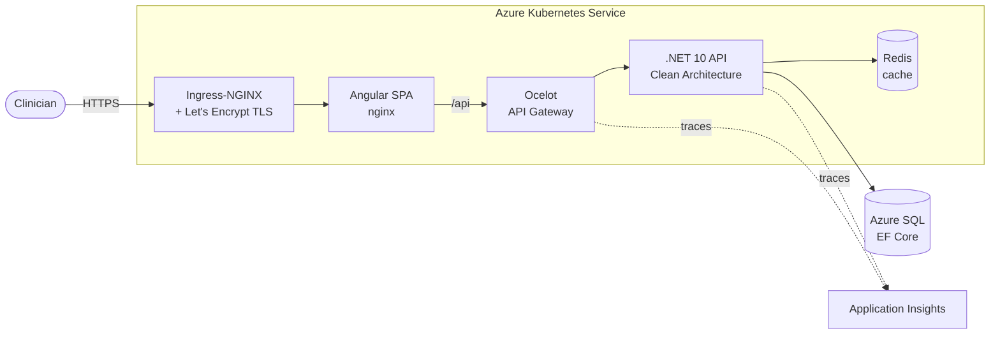
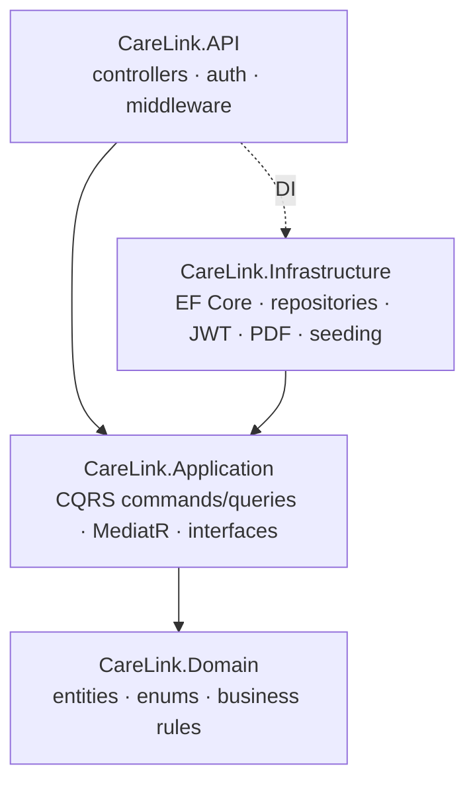
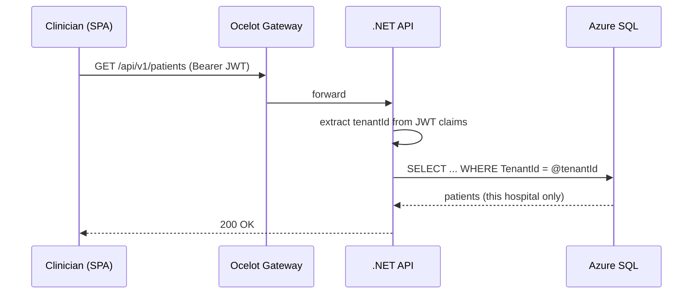
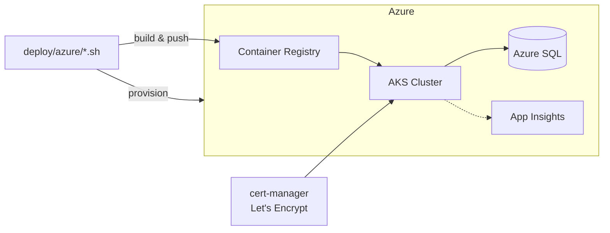

<div align="center">

# 🫀 Med Clinician Portal - To Present to Hiring Team

### A production-grade, multi-tenant remote cardiac-monitoring platform for clinicians

Manage patients with implanted cardiac devices (ICD, Pacemaker, CRT, ICM) across multiple hospitals — real-time alerts, transmission scheduling, PDF reporting, and full audit trails, in four languages.

[](https://dotnet.microsoft.com/)
[](https://angular.dev/)
[](https://azure.microsoft.com/)
[](https://kubernetes.io/)
[](#-testing)
[](#-license)

**[🌐 Live Demo](https://carelink.20.241.145.139.nip.io/)** · [Features](#-features) · [Architecture](#-architecture) · [Getting Started](#-getting-started) · [Deployment](#-deployment)

</div>

---

> [!NOTE]
> **Live demo:** https://carelink.20.241.145.139.nip.io/ — deployed on Azure Kubernetes Service with a trusted HTTPS certificate.
> Demo credentials are listed under [Live Demo](#-live-demo) below.

> 🎥 **See it in action:** open the **[live demo](https://carelink.20.241.145.139.nip.io/)**.

---

## ✨ Features

### 🏥 Multi-hospital, multi-tenant
- **Strict tenant isolation** — every query is scoped to the clinician's hospital, derived server-side from JWT claims (never trusted from the client).
- **One clinician, many hospitals** — switch active hospital from the header; the patient list, alerts, and reports all follow.
- **Self-service hospital onboarding** — a platform **SuperAdmin** provisions new hospitals and their first admin through the UI, each with a one-time temporary password.

### 👤 Patient management
- Patient registry with **advanced search** (device type, active status, implant-date range, keyword).
- Rich patient detail: **Overview · Profile · Equipment · Schedule · History (charts) · CareAlert · Reports · Notes** tabs.
- Transmission-history charts (heart rate & battery) rendered with Chart.js.

### 🚨 Alerts & scheduling
- Automatic alert evaluation — **Disconnected Monitor, Low Battery, Irregular Heartbeat** — with Red/Yellow urgency.
- **Clinic-default + per-patient override** settings for alert urgency, transmission interval, and report cadence.
- Acknowledge / snooze workflow; clinic-wide **Transmission Schedule** view with sortable next-due dates.

### 📄 Reporting & records
- On-demand **PDF report generation** (QuestPDF) with download.
- Threaded **Comments & Notes** per patient, attributed to the authoring clinician.

### 🔐 Security & operations
- JWT auth with httpOnly refresh-token rotation; **BCrypt** password hashing; role-based access (Clinician / Admin / SuperAdmin).
- **Immutable audit log** of every sensitive action, with an admin-facing viewer and filters.
- Production hardening: **API versioning, global exception handling, Redis response caching, health checks (liveness/readiness), and structured audit logging**.
- **OpenTelemetry → Azure Application Insights** distributed tracing across gateway and API.

### 🌍 Internationalization
- Full UI translations in **English, French, German, Spanish** (ngx-translate), with automatic locale/country detection at login.

---

## 📸 Screenshots

| Dashboard | Patient Detail |
|:---:|:---:|
|  |  |

| Advanced Search | Multi-language (Español) |
|:---:|:---:|
|  |  |

---

## 🏗 Architecture

A **.NET Clean Architecture** backend behind an **Ocelot API gateway**, with an **Angular** SPA served by nginx. Everything is containerized and runs on Kubernetes.



### Clean Architecture layers



The **Domain** has no dependencies; **Application** defines interfaces that **Infrastructure** implements; the **API** wires everything via dependency injection. Requests flow through **CQRS handlers** dispatched by MediatR.

### Multi-tenant request flow



---

## 🧰 Tech Stack

| Layer | Technologies |
|---|---|
| **Frontend** | Angular 17 (standalone components), NgRx, RxJS, ngx-translate, Chart.js, Reactive Forms |
| **Backend** | .NET 10, Clean Architecture, CQRS + MediatR, EF Core 10, Ocelot gateway |
| **Data** | Azure SQL / SQL Server, Redis (caching), EF Core migrations |
| **Auth** | JWT (access + refresh), BCrypt, role-based authorization, multi-tenant claims |
| **Reporting** | QuestPDF |
| **Testing** | xUnit + Moq, Jest, Cypress |
| **DevOps** | Docker, Kubernetes (AKS), Kustomize, Azure DevOps Pipelines, Helm |
| **Observability** | OpenTelemetry, Azure Application Insights, health checks |

---

## 🧪 Testing

Comprehensive automated coverage across the stack:

| Suite | Tool | Tests | Scope |
|---|---|:---:|---|
| Backend unit | xUnit + Moq | **134** | CQRS handlers, auth, alert evaluation, tenant isolation, PDF generation |
| Frontend unit | Jest | **110** | Components, guards, interceptors, NgRx, i18n |
| End-to-end | Cypress | **23** | Auth, patient flows, multi-hospital switching, hospital onboarding, reports |

```bash
# Backend
dotnet test CareLink.CleanArchitecture

# Frontend unit
cd frontend && npm test

# End-to-end (requires the stack running)
cd frontend && npx cypress run
```

---

## 🚀 Getting Started

### Prerequisites
- [Docker Desktop](https://www.docker.com/products/docker-desktop/)
- [.NET 10 SDK](https://dotnet.microsoft.com/download)

### Run the whole stack with Docker

```bash
git clone https://github.com/Iswariyabalasubramani24/carelink-clinician-portal.git
cd carelink-clinician-portal

cp .env.example .env        # fill in the values (see comments in the file)
docker compose -p carelink-prod -f docker-compose.prod.yml up -d --build
```

Open **http://localhost:8081**. On first start the API migrates the schema and seeds a platform SuperAdmin; in Development it also seeds demo hospitals and patients.

### Run for local development

```bash
# 1. Infrastructure (SQL Server, Redis, Kafka)
docker compose up -d

# 2. Backend API + gateway
dotnet run --project CareLink.CleanArchitecture/CareLink.API      # :5010
dotnet run --project api-gateway                                   # :5000

# 3. Frontend
cd frontend && npm install && npm start                            # :4200
```

**Demo logins (Development):**

| Role | Email | Password |
|---|---|---|
| Clinician | `doctor@apollo.com` | `Test@123` |
| Admin | `admin@apollo.com` | `Admin@123` |

---

## ☁️ Deployment

Fully scripted deployment to **Azure Kubernetes Service** with Azure SQL, ACR, Application Insights, and automatic HTTPS.



```bash
cd deploy/azure
export SQL_ADMIN_PASSWORD='...'
./00-provision.sh          # resource group, ACR, AKS, Azure SQL, App Insights
./01-deploy.sh             # build/push images, deploy manifests, bind a URL
./02-https.sh              # trusted TLS via cert-manager + Let's Encrypt
```

📖 **Full runbook:** [`deploy/azure/README.md`](deploy/azure/README.md)

Kubernetes manifests live in [`deploy/k8s/`](deploy/k8s/); an **Azure DevOps CI/CD pipeline** ([`azure-pipelines.yml`](azure-pipelines.yml)) runs tests, builds images, and deploys to AKS behind an approval gate.

---

## 🌐 Live Demo

**https://carelink.20.241.145.139.nip.io/**

> [!IMPORTANT]
> For a public link, sign in with a **limited clinician account**, not the SuperAdmin.
> Provision a demo hospital + clinician via the SuperAdmin (Hospitals page), then list that clinician's credentials here:

| Role | Email | Password |
|---|---|---|
| Clinician | `_your demo clinician_` | `_password_` |

---

## 📂 Project Structure

```
carelink-clinician-portal/
├── CareLink.CleanArchitecture/     # .NET backend (Domain, Application, Infrastructure, API)
│   └── tests/CareLink.UnitTests/   # xUnit tests
├── api-gateway/                    # Ocelot API gateway
├── frontend/                       # Angular 17 SPA
│   ├── src/app/                    # features, core, store (NgRx)
│   └── cypress/e2e/                # Cypress specs
├── deploy/
│   ├── k8s/                        # Kubernetes manifests (Kustomize)
│   └── azure/                      # provisioning + deploy scripts + runbook
├── docker-compose.yml              # local dev infrastructure
├── docker-compose.prod.yml         # full production stack
└── azure-pipelines.yml             # CI/CD
```

---

## 🗺 Roadmap

- [ ] cert-manager `HTTPRoute` + custom domain
- [ ] Real-time alert push (SignalR / WebSockets)
- [ ] Patient edit & soft-delete
- [ ] Paginated patient list for large tenants
- [ ] Grafana dashboards over the OpenTelemetry metrics

---

## 📝 License

Released under the [MIT License](LICENSE).

<div align="center">

Built with ❤️ using .NET, Angular, and Azure.

</div>
